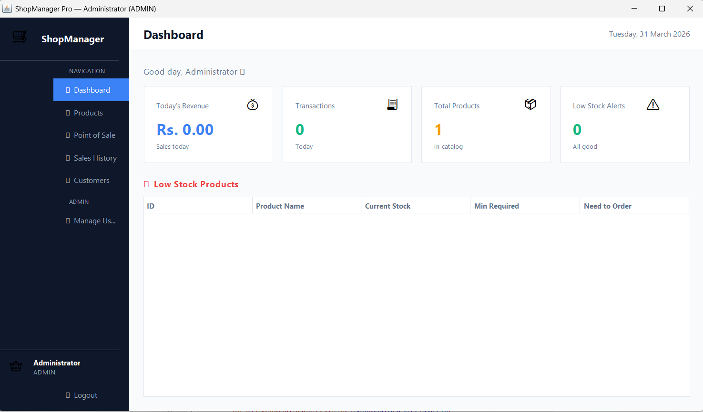
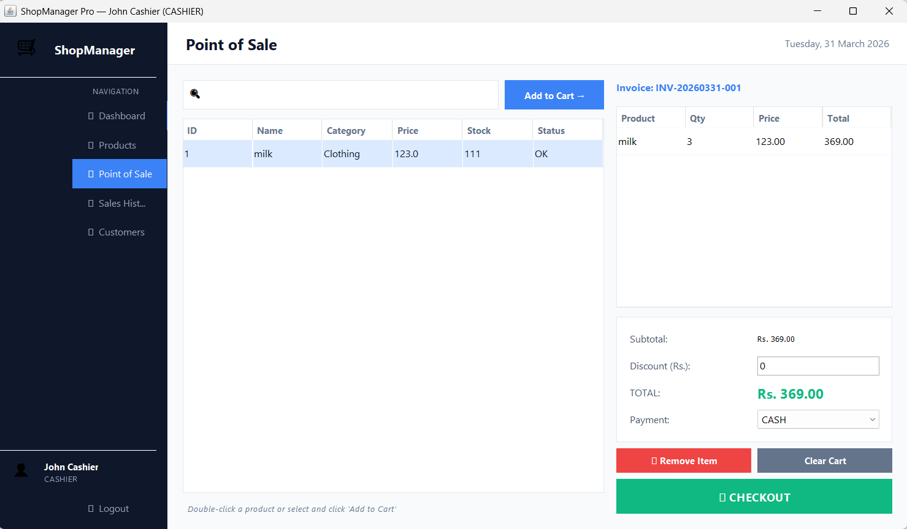
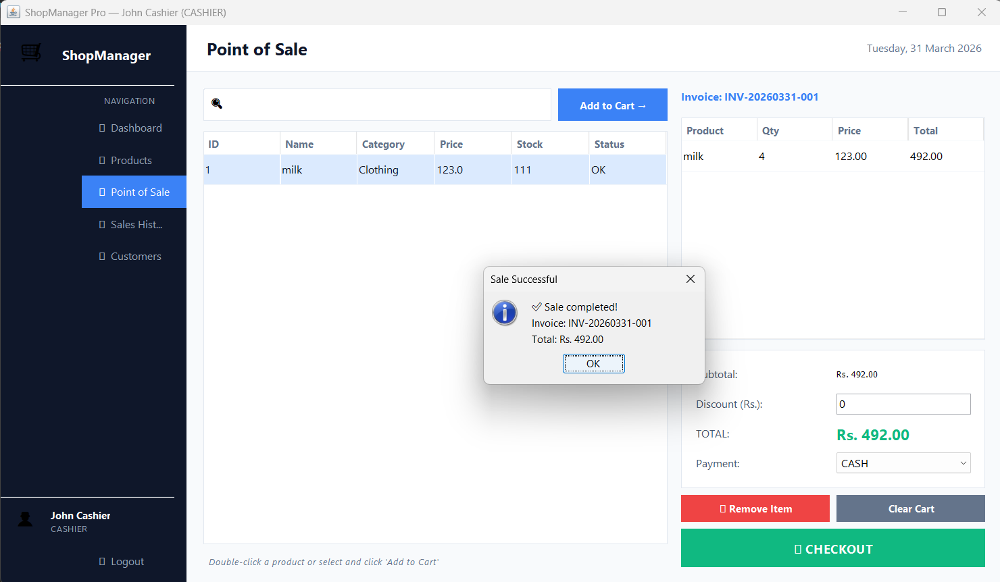
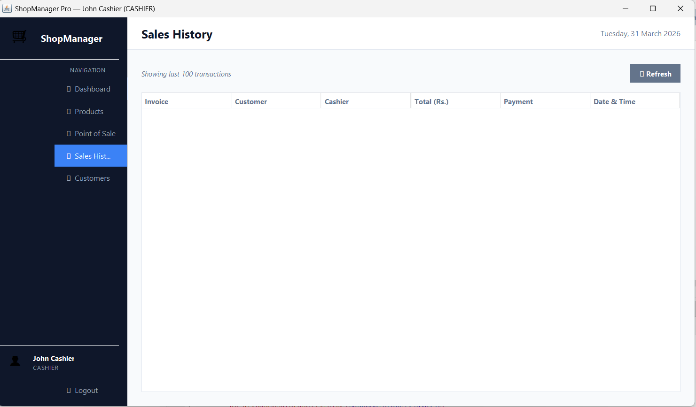

# 🛒 Shop Management System


A fully functional **desktop-based Shop Management System** built with Java Swing and MySQL. Designed for real-world retail shop operations with role-based access, real-time inventory tracking, and a modern UI.

---

## 📸 Screenshots

### Login Screen


### Admin Dashboard


### Product Management


### Point of Sale


### Sale Invoice


### Customer Management


### Sales History



---

## ✨ Features

- 🔐 **Secure Login** — Role-based access for Admin and Cashier
- 📊 **Dashboard** — Real-time stats: today's revenue, transactions, low stock alerts
- 📦 **Product Management** — Add, edit, delete, search products with category support
- 🛒 **Point of Sale (POS)** — Full billing system with invoice generation
- 📋 **Sales History** — Complete transaction records with invoice numbers
- 👥 **Customer Management** — Add, edit, delete customer records
- 👤 **User Management** — Admin can create and manage cashier accounts
- ⚠️ **Low Stock Alerts** — Automatic alerts when products fall below minimum stock

---

## 🏗️ Project Structure

```
ShopManagementSystem/
├── src/
│   ├── model/
│   │   ├── User.java           # Authentication & user management
│   │   ├── Product.java        # Product CRUD operations
│   │   └── Sale.java           # Sales & invoice logic
│   ├── ui/
│   │   ├── LoginFrame.java     # Modern login screen
│   │   ├── MainFrame.java      # Sidebar navigation
│   │   ├── DashboardPanel.java # Stats & low stock alerts
│   │   ├── ProductPanel.java   # Product management UI
│   │   ├── POSPanel.java       # Point of sale billing
│   │   ├── HistoryPanel.java   # Sales history
│   │   ├── CustomerPanel.java  # Customer management
│   │   └── UserPanel.java      # User management (Admin only)
│   └── util/
│       ├── DBConnection.java   # MySQL connection utility
│       └── PasswordUtil.java   # Password handling
└── Database/                   # MySQL database SQL files
```

---

## 🛠️ Tech Stack

| Technology | Purpose |
|-----------|---------|
| Java JDK 17 | Core application language |
| Java Swing | Desktop UI framework |
| MySQL 8.0 | Database |
| JDBC | Database connectivity |
| Apache NetBeans 17 | IDE |

---

## ⚙️ Setup Instructions

### Prerequisites
- Java JDK 17+
- MySQL 8.0+
- Apache NetBeans 17
- MySQL Workbench

### Step 1 — Database Setup
1. Open MySQL Workbench
2. Run all SQL files from the `Database/` folder in order
3. This creates the `shop_management` database with all tables

### Step 2 — Configure Database Connection
Open `src/util/DBConnection.java` and update:
```java
private static final String URL = "jdbc:mysql://localhost:3306/shop_management?useSSL=false&allowPublicKeyRetrieval=true&serverTimezone=UTC";
private static final String USER = "root";
private static final String PASSWORD = "your_mysql_password";
```

### Step 3 — Add Required Libraries
Add these JAR files to your NetBeans project Libraries:
- `mysql-connector-j-9.6.0.jar`
- `jbcrypt-0.4.jar`

### Step 4 — Set Main Class & Run
1. Right-click project → Properties → Run
2. Set Main Class: `ui.LoginFrame`
3. Press **F6** to run

## 📊 Database Schema

| Table | Description |
|-------|-------------|
| users | Login credentials and roles |
| products | Product catalog with stock levels |
| categories | Product categories |
| customers | Customer records |
| sales | Sales transaction headers |
| sale_items | Individual items per sale |
| suppliers | Supplier information |

---
## 📄 License & Copyright

```
Copyright © 2026 D. Chenthan. All Rights Reserved.

This project and all its contents are the intellectual property of D. Chenthan.
Unauthorized copying, modification, distribution, or use of this project
in any form is strictly prohibited without explicit written permission.

This repository is published for portfolio and demonstration purposes only.
```

---

<div align="center">

**Built by D. Chenthan**

Software Engineering Undergraduate · NSBM Green University · Sri Lanka 🇱🇰

[](https://www.linkedin.com/in/d-chenthan-25018535b)
[](https://github.com/Chenthan006)

*© 2026 D. Chenthan · All Rights Reserved*

</div>